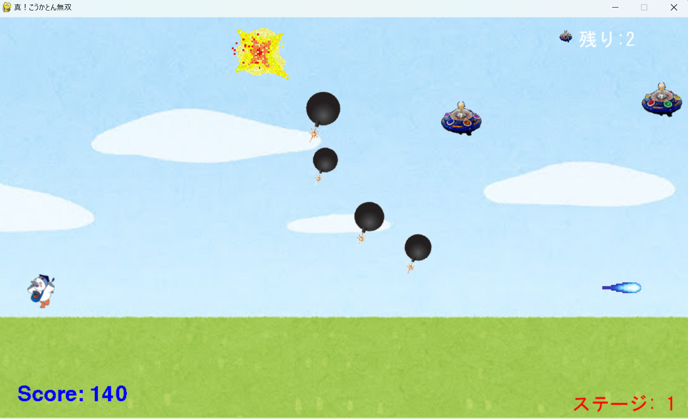

# "真！真！こうかとん無双"

## 実行環境の必要条件
* python >= 3.10
* pygame >= 2.1

## ゲームの概要
* 主人公キャラクターこうかとんをWSDキー操作により動き、マウスで照準を操作しクリックでビームを発射して敵と戦うゲームである。スコアに応じて、敵の爆弾の数や速度がが段階的に増加する。ゲームの目標は、敵の攻撃をかわしながらスコアを稼ぎ、最終的にボスを倒してステージをクリアすることである。ステージは２つある。１ステージ目に敵を15体倒すと、ステージが移動し、ボスが出現され、それを倒すとゲームクリアとなる。ボスと一緒に3つの雑魚敵が出現される。その3つの雑魚敵を倒すことで弾幕を3回使用できるようになる。

## ゲームの遊び方
* WSDキーでこうかとんを操作する
* 左Shiftキー押下しながらWSDキーで移動すると高速化する
* 左クリックでビームを発射し、敵や爆弾を倒す
* 右クリックで弾幕を使う
* スコアが100より大きい場合、リターンキーを押下することで重力場になり敵が倒れる
* スコアが20より大きい場合、「e」キーを押下することで発動時に存在する敵機と爆弾を無効化する
* スコアが50より大きい場合、右Shiftキーを押下することで爆弾に当たっても死なない無敵状態になる
* スコアが50より大きい場合、「s」キーを押下することでこうかとんの前に防御壁を出現させ，着弾を防ぐ
* 敵の爆弾に当たったら，ゲームオーバーとなる

## ゲームの実装
### 共通基本機能
* グロバール変数　reference 200, 500, 背景画像、主人公キャラクターの描画、敵の描画

### 分担追加機能
* ステージの遷移（担当：東）：ゲーム開始、ステージ数表示に関するクラス
- ステージ進行管理 (StageManager クラス)を定義する。
- 現在のステージ番号の表示する。
- 敵を倒した数に応じてステージクリア条件をチェックする。
- ステージ遷移時のクリアメッセージ表示する。
- 最終ステージクリア時のゲームクリア条件をチェックする。
- 開始画面管理 (StartScreen クラス)、タイトル画面の表示（ゲーム開始や操作説明の選択が可能）。
-main 関数の更新、ゲーム中のステージ遷移処理を追加。
-ゲームオーバー時やクリア時の再初期化処理を追加。
* 雑魚敵の射角を段階的に強化する機能（担当：テムジン）：スコアに応じて段階的に敵の攻撃を増やす機能。
- BombProjectileクラスを定義し、スコアに応じて敵の攻撃が増強されるようにする。
- 爆弾の発射数、速度、射出角度の段階的な変化を取り入れる。
- スコアが50以上になったら爆弾の発射数が3になる。
- スコアが100以上になったら爆弾の発射数が5になる。
* ボス描画機能（担当：劉）：2ステージ目になるとボスが出現される。球の数や撃つバリエーションを増やすクラス
* 雑魚敵にシールド付与、一定のダメージで割れる（担当：木町）：敵にシールド付与、1撃で割れる
* マウスなどで標準を実装する機能（担当：藤本）：マウスで発射するビームの向きを変える。WSDの移動。
* NeoBeamの状態を画面に表示する機能（担当：テムジン）：StageManager クラスにNeoBeamの状態が表示されるようにする。
- NeoBeamの状態をリセットするreset_neobeam_uses()関数
- NeoBeamの状態を表示させるdisplay_neobeam_status()関数
  
### ToDo
- [ ] 爆弾の向きの改善
- [ ] 効果音
- [ ] ステージ遷移機能
- [ ] main関数内のループ
- [ ] ターゲットマーク

### メモ
* 場面変化の基準スコアのグロバール変数referenceを200に設定している
* 爆弾円を画像に変更している
* すべてのクラスに関係する関数は，クラスの外で定義してある
